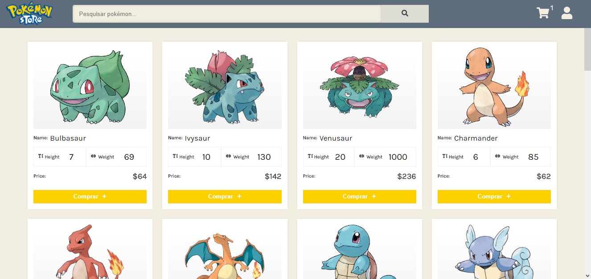
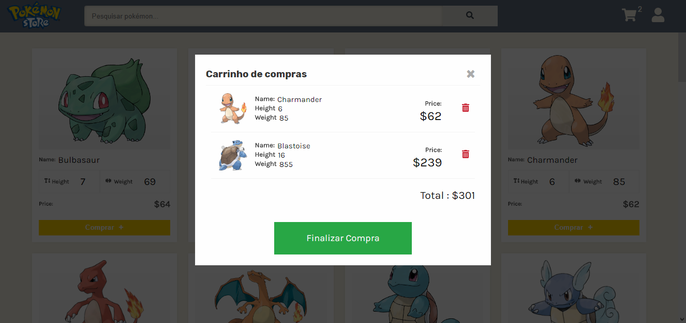
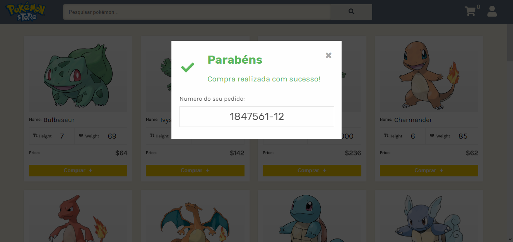

<h1 align="center">
    
</h1>

  

  

  

#### Projeto feito apenas para fins educativos

## :rocket: Desafio: Loja Online - Pokestore

Hoje estou trazendo aqui mais um desafio realizado para o HiringCoders da Gama Academy.

O Projeto é baseado em vivenciar a experiência de construir uma loja virtual, e mostrar como seria uma loja de Pokémon.

Um projeto divertido.

Foi utilizado nesse projeto a pokeapi(https://pokeapi.co/), uma api com dados de todos os Pokémon (ou quase todos).

Após requisitar os Pokémon, os preços foram gerados aleatoriamente.

Layout foi feito completamente do zero.

## 💻 PokeStore - Preview

O Projeto foi finalizado e feito deploy pelo netlify.

http://jorge-pokestore.netlify.app

<h1 align="center">
    
</h1>
<h1 align="center">
    
</h1>
<h1 align="center">
    
</h1>

## :clipboard: Principais conceitos utilizados

Para esse projeto, foi utilizado a biblioteca do javascript, com o principal diferencial.

Linguagens utilizadas
- React

## :label: Envolvidos no desenvolvimento

Jorge Henrique – [@LinkedIn](https://www.linkedin.com/in/jorge-henrique-baptista/) – jorgehenrique@live.com

The MIT License (MIT)

Copyright (c) 2020